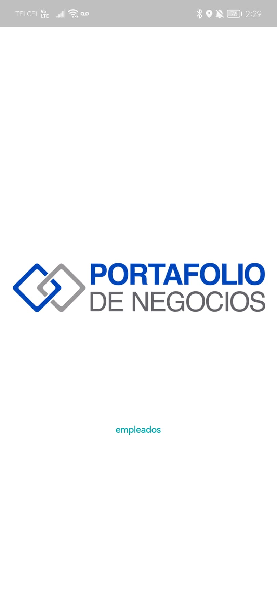
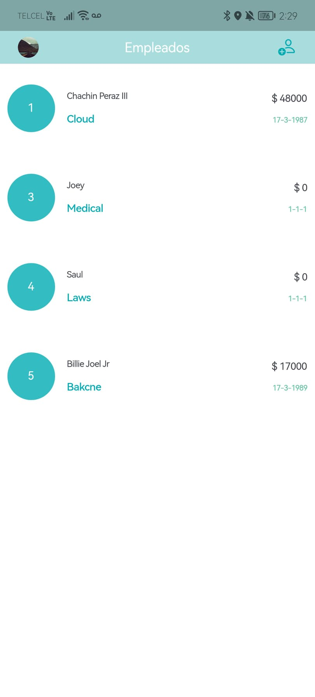
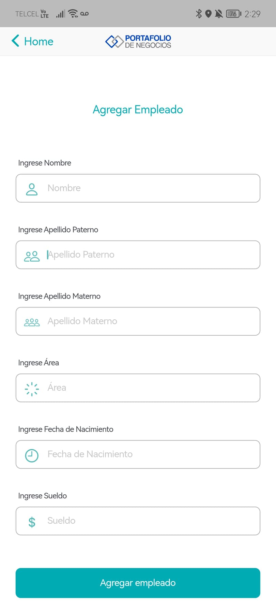
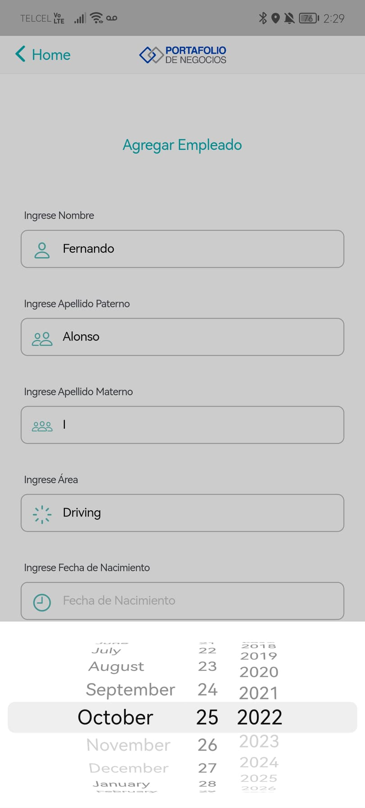
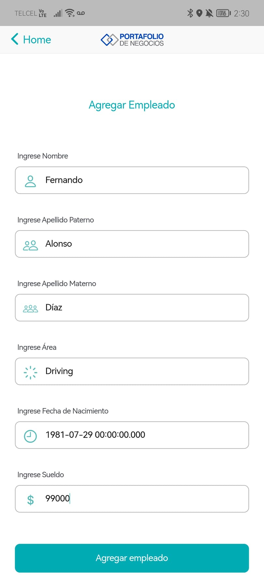
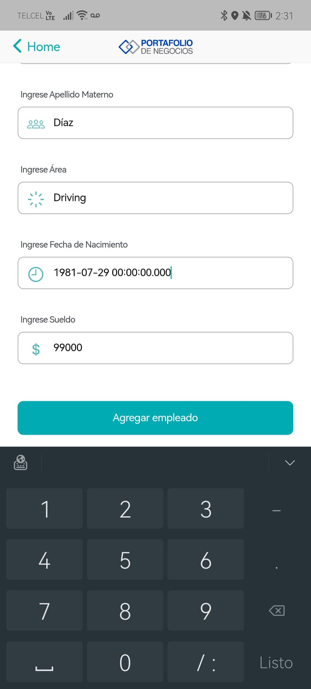
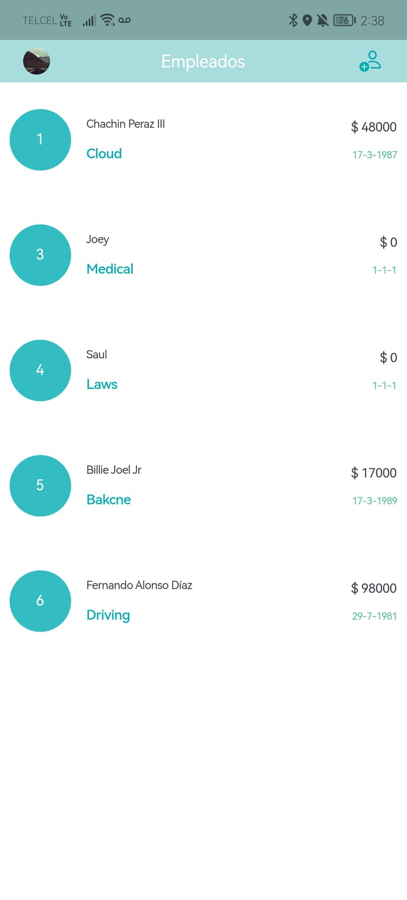
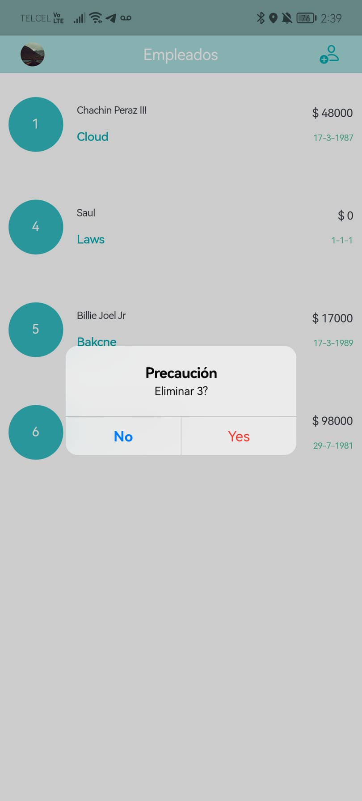

# empleados

A Portafolio de Negocios Empleados App.

## Getting Started

This project is a little Flutter application for Employee management.

A few resources to get you started if this is your first Flutter project:

- [Lab: Write your first Flutter app](https://docs.flutter.dev/get-started/codelab)
- [Cookbook: Useful Flutter samples](https://docs.flutter.dev/cookbook)

This App connects to backend made with go, found at this repository:

- [GO Empleados REST API](https://github.com/FernandoMay/goempleados)

To run empleados flutter app:

```
$ flutter run 
```

For help getting started with Flutter development, view the
[online documentation](https://docs.flutter.dev/), which offers tutorials,
samples, guidance on mobile development, and a full API reference.








